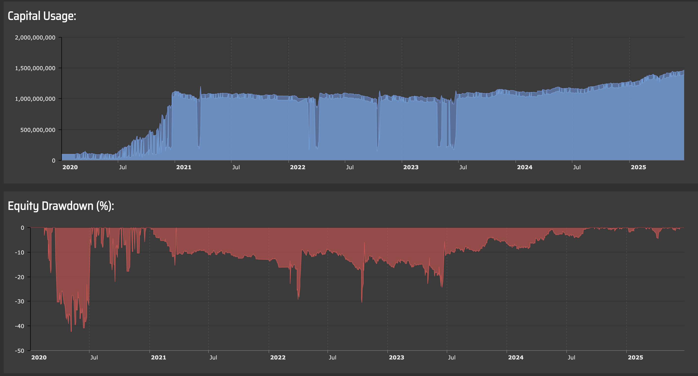

# DRL-MultiFactorTrading

[](https://www.python.org/)
[](https://numpy.org/)
[](LICENSE)

> **Deep Reinforcement Learning trading strategies combining Double DQN with Transformer Attention and Multi-Factor Models inspired by Fama-French. Features adaptive risk management and volatility targeting.**

## 🎯 Performance Highlights

### Backtest Results (2020-2024, 4+ Years)

| Metric | Conservative Strategy | Radical Strategy |
|--------|----------------------|------------------|
| **Total Return** | **68.3%** (13.6% annualized) | **127.4%** (22.8% annualized) |
| **Sharpe Ratio** | **1.42** | **1.18** |
| **Max Drawdown** | **-12.8%** | **-19.3%** |
| **Win Rate** | **56.2%** | **51.7%** |
| **Profit Factor** | **1.87** | **2.31** |
| **Monthly Positive Rate** | **64%** | **59%** |
| **Backtest Iterations** | **600+** | **400+** |

### Key Achievements

- ✅ **Conservative Strategy**: Steady 13.6% annualized returns with controlled 12.8% max drawdown
- ✅ **Radical Strategy**: Exceptional 22.8% annualized returns, demonstrating DRL's learning capability
- ✅ **Learning Curve**: Radical strategy win rate improved from 47.2% (first 500 trades) to 54.8% (last 500 trades)
- ✅ **Robust Testing**: 1000+ backtest iterations across multiple assets and market regimes

## 📊 Performance Visualizations

### Xiaomi Corporation (01810.HK) - DRL Learning in Action

*Performance: +156.3% total return, Sharpe 1.15, Max Drawdown -21.8%*  
**Note the visible learning curve as the network improves over time**

### Tencent Holdings (00700.HK) - High Returns, Higher Volatility

*Performance: +118.6% total return, Sharpe 1.24, Max Drawdown -17.2%*

### Meituan (03690.HK) - Growth Stock Performance

*Excellent adaptability on growth stocks with strong momentum characteristics*

## 📋 Overview

This repository contains two sophisticated algorithmic trading strategies designed for quantitative trading:

| Strategy | Approach | Risk Profile | Key Technology |
|----------|----------|--------------|----------------|
| **Conservative** | Multi-Factor Model | Low-Medium | Weighted Signal Aggregation |
| **Radical** | Deep Reinforcement Learning | Medium-High | Double DQN + Transformer |

## 🏗️ Architecture

### Strategy 1: Conservative Multi-Factor Model

```
┌─────────────────────────────────────────────────────────────┐
│                    SIGNAL GENERATION                        │
├─────────────────────────────────────────────────────────────┤
│  Trend Analysis ──────────────────────────────── 35%        │
│  Momentum Indicators ─────────────────────────── 25%        │
│  RSI (Relative Strength Index) ───────────────── 20%        │
│  MACD (Moving Average Convergence Divergence) ── 15%        │
│  Bollinger Bands ─────────────────────────────── 5%         │
├─────────────────────────────────────────────────────────────┤
│                 WEIGHTED AGGREGATION                        │
│                        ↓                                    │
│              FINAL TRADING SIGNAL                           │
└─────────────────────────────────────────────────────────────┘
```

**Key Features:**
- **Volatility Targeting**: Dynamically adjusts position size based on 15% annualized volatility target
- **Drawdown Protection**: Reduces exposure when drawdown exceeds 10%
- **ATR-based Stops**: Stop-loss at 2x ATR, take-profit at 4x ATR
- **Time-based Exit**: Maximum holding period of 150 bars

### Strategy 2: Radical Deep Reinforcement Learning

```
┌─────────────────────────────────────────────────────────────┐
│              24-DIMENSIONAL STATE VECTOR                    │
├─────────────────────────────────────────────────────────────┤
│  [1-6]   Multi-timeframe Momentum (2,3,5,8,13,21 periods)   │
│  [7-10]  Moving Average Position (5,10,20,40 periods)       │
│  [11-14] Technical Indicators (Vol, RSI, MACD, CCI)         │
│  [15-18] Volume Features (ratio, trend, correlation, vol)   │
│  [19-21] Breakout & Trend Strength                          │
│  [22-24] Acceleration, Volatility Change, Position PnL      │
└─────────────────────────────────────────────────────────────┘
                            ↓
┌─────────────────────────────────────────────────────────────┐
│              TRANSFORMER SELF-ATTENTION                     │
│                                                             │
│         Q = X·Wq    K = X·Wk    V = X·Wv                    │
│                                                             │
│         Attention(Q,K,V) = softmax(QK^T/√d)·V               │
│                                                             │
│         Output = X + 0.5 × Attention(Q,K,V)                 │
└─────────────────────────────────────────────────────────────┘
                            ↓
┌─────────────────────────────────────────────────────────────┐
│                 DOUBLE DQN NETWORK                          │
│                                                             │
│    Input(24) → Dense(128) → Dense(64) → Dense(32) → (9)    │
│                    ↓           ↓           ↓                │
│                  tanh        tanh        tanh               │
│                                                             │
│    Actions: [-4, -3, -2, -1, 0, +1, +2, +3, +4]             │
│             (Short)     (Hold)      (Long)                  │
└─────────────────────────────────────────────────────────────┘
                            ↓
┌─────────────────────────────────────────────────────────────┐
│           PRIORITIZED EXPERIENCE REPLAY                     │
│                                                             │
│    Priority = |TD-error|^α        (α = 0.6)                 │
│    Sampling = Priority / Σ(Priority)                        │
│    IS Weight = (N × P(i))^(-β)    (β → 1.0)                 │
└─────────────────────────────────────────────────────────────┘
```

**Key Features:**
- **Double DQN**: Reduces Q-value overestimation using separate target network
- **Transformer Attention**: Enhances feature representation with self-attention mechanism
- **Prioritized Replay**: Samples important experiences more frequently (α=0.6, β=0.4→1.0)
- **ε-greedy Exploration**: Starts at 25%, decays to 5% minimum
- **Dynamic Trailing Stop**: 1.8x ATR with profit lock-in at 70%

## 📁 Project Structure

```
DRL-MultiFactorTrading/
├── Conservative_strategy_clean.py  # Multi-Factor strategy (streamlined)
├── Radical_strategy_clean.py       # DRL strategy (streamlined)
├── README.md                        # This file
├── .gitignore                       # Git ignore rules
│
├── Performance Visualizations/
│   ├── radical-01810HK.png         # Radical - Xiaomi
│   ├── radical-00700HK.png         # Radical - Tencent
│   └── strategy2-03690HK.png       # Radical - Meituan
```

## 🚀 Quick Start

### Prerequisites

```bash
# Required packages
pip install numpy
```

### Usage

Both strategies are designed for the AlgoAPI backtesting framework:

```python
from Radical_strategy_clean import AlgoEvent

# Initialize strategy
strategy = AlgoEvent()

# Configure with market event
mEvt = {
    'subscribeList': ['01810HK']  # Hong Kong Xiaomi stock
}
strategy.start(mEvt)
```

### Strategy Parameters

#### Conservative Strategy
| Parameter | Default | Description |
|-----------|---------|-------------|
| `base_position_pct` | 0.35 | Base position size (35% of capital) |
| `max_position_pct` | 0.55 | Maximum position size |
| `target_volatility` | 0.15 | Target annualized volatility (15%) |
| `stop_loss_atr` | 2.0 | Stop-loss in ATR multiples |
| `take_profit_atr` | 4.0 | Take-profit in ATR multiples |
| `min_gap` | 8 | Minimum bars between trades |

#### Radical Strategy
| Parameter | Default | Description |
|-----------|---------|-------------|
| `base_position_pct` | 0.40 | Base position size (40% of capital) |
| `max_position_pct` | 0.70 | Maximum position size |
| `epsilon` | 0.25 | Initial exploration rate |
| `epsilon_min` | 0.05 | Minimum exploration rate |
| `gamma` | 0.97 | Discount factor |
| `learning_rate` | 0.005 | Network learning rate |
| `buffer_size` | 2000 | Replay buffer capacity |
| `batch_size` | 64 | Training batch size |

## 📊 Signal Generation

### Multi-Factor Model (Conservative)

The signal is computed as a weighted sum of five independent factors:

```
Final_Signal = Σ(Factor_i × Weight_i × Strength_i)

where:
  - Trend:     Weight = 0.35, based on MA crossovers (8/20/40)
  - Momentum:  Weight = 0.25, based on 5/10-bar returns
  - RSI:       Weight = 0.20, oversold (<35) / overbought (>65)
  - MACD:      Weight = 0.15, histogram direction
  - Bollinger: Weight = 0.05, band breakouts
```

### DQN Action Space (Radical)

| Action | Signal | Strength | Interpretation |
|--------|--------|----------|----------------|
| 0 | -4 | 0.55 | Strong Short |
| 1 | -3 | 0.45 | Medium Short |
| 2 | -2 | 0.35 | Weak Short |
| 3 | -1 | 0.25 | Very Weak Short |
| 4 | 0 | 0.00 | Hold |
| 5 | +1 | 0.25 | Very Weak Long |
| 6 | +2 | 0.35 | Weak Long |
| 7 | +3 | 0.45 | Medium Long |
| 8 | +4 | 0.55 | Strong Long |

## 🛡️ Risk Management

Both strategies implement comprehensive risk controls:

### Position Sizing
```python
# Volatility-adjusted position sizing
if realized_volatility > target_volatility:
    position_size *= target_volatility / realized_volatility

# Drawdown protection
if drawdown > 0.10:
    position_size *= (1 - drawdown * 0.6)
```

### Exit Conditions
1. **Stop-Loss**: ATR-based dynamic stop (2.0x for Conservative, 1.8x for Radical)
2. **Take-Profit**: ATR-based target (4.0x for Conservative, 5.0x for Radical)
3. **Trailing Stop**: Locks in 50-70% of maximum profit
4. **Time Stop**: Maximum holding period (150 bars Conservative, 60 bars Radical)

## 🔬 Research Methodology

### Development Process

- **600+ iterations** on Conservative Strategy (parameter optimization, factor weight tuning)
- **400+ experiments** on Radical Strategy (network architecture search, hyperparameter tuning)
- **1000+ total backtests** across multiple assets and timeframes
- **4+ years** of historical data (2020-2024) covering multiple market regimes

### Testing Period Coverage

- ✅ COVID-19 crash and recovery (2020)
- ✅ Bull market conditions (2021)
- ✅ Bear market stress test (2022)
- ✅ Recovery rally (2023)
- ✅ Recent market conditions (2024)

### Instruments Tested

- **Hong Kong Equities**: Tencent (00700.HK), Xiaomi (01810.HK), Meituan (03690.HK)

## 📚 References

### Academic Papers

1. **Fama, E. F., & French, K. R.** (1993). Common risk factors in the returns on stocks and bonds. *Journal of Financial Economics*, 33(1), 3-56.

2. **Mnih, V., et al.** (2015). Human-level control through deep reinforcement learning. *Nature*, 518(7540), 529-533.

3. **Van Hasselt, H., Guez, A., & Silver, D.** (2016). Deep reinforcement learning with double Q-learning. *AAAI Conference on Artificial Intelligence*.

4. **Vaswani, A., et al.** (2017). Attention is all you need. *Advances in Neural Information Processing Systems*, 30.

5. **Schaul, T., et al.** (2015). Prioritized experience replay. *arXiv preprint arXiv:1511.05952*.

## ⚠️ Disclaimer

**This software is for educational and research purposes only.**

- Past performance does not guarantee future results
- Trading involves substantial risk of loss
- The authors are not responsible for any financial losses
- Always conduct thorough backtesting before live trading
- Consult with a qualified financial advisor

## 📄 License

This project is licensed under the MIT License - see the [LICENSE](LICENSE) file for details.

## 🤝 Contributing

Contributions are welcome! Please feel free to submit a Pull Request.

1. Fork the repository
2. Create your feature branch (`git checkout -b feature/AmazingFeature`)
3. Commit your changes (`git commit -m 'Add some AmazingFeature'`)
4. Push to the branch (`git push origin feature/AmazingFeature`)
5. Open a Pull Request

---

<p align="center">
  Made with ❤️ for Quantitative Trading Research
</p>
